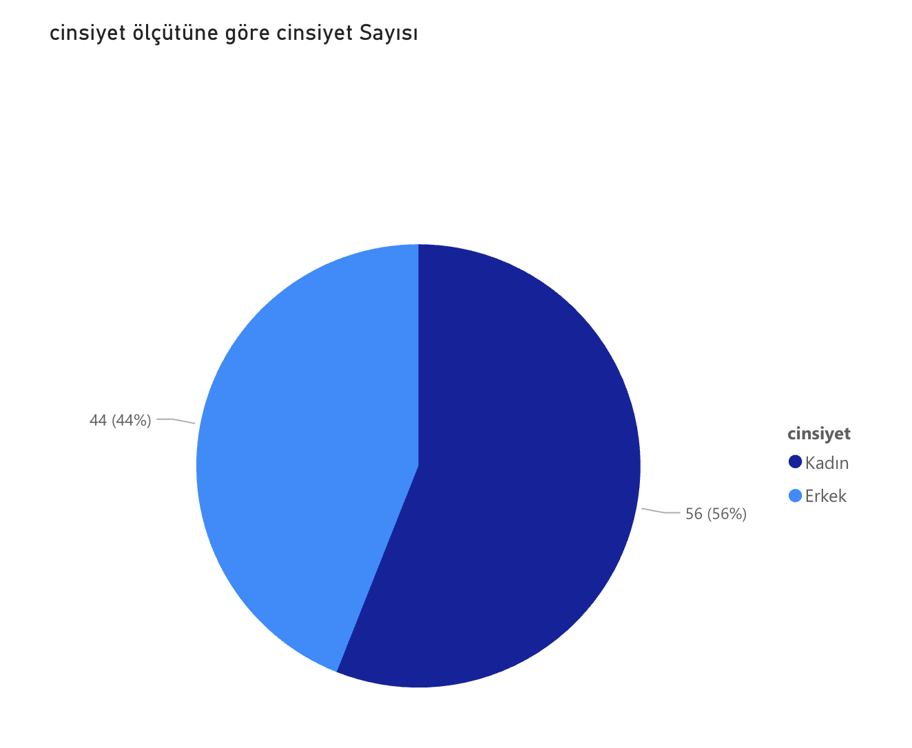
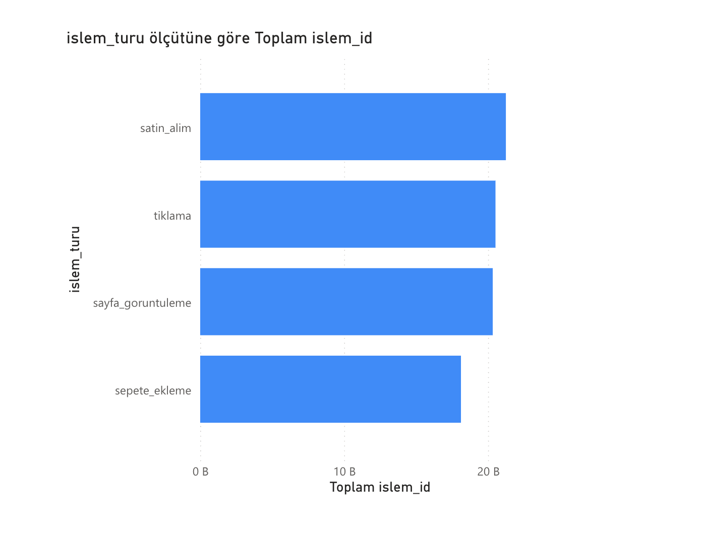
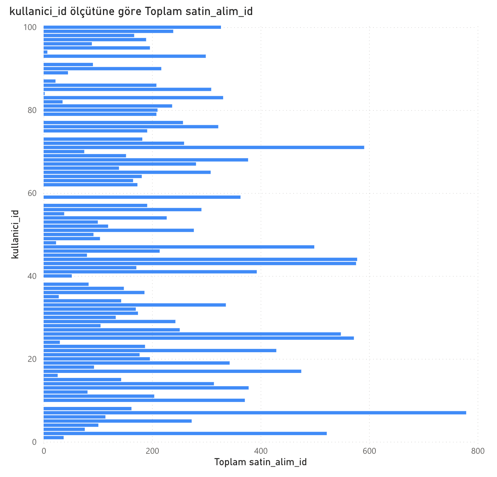
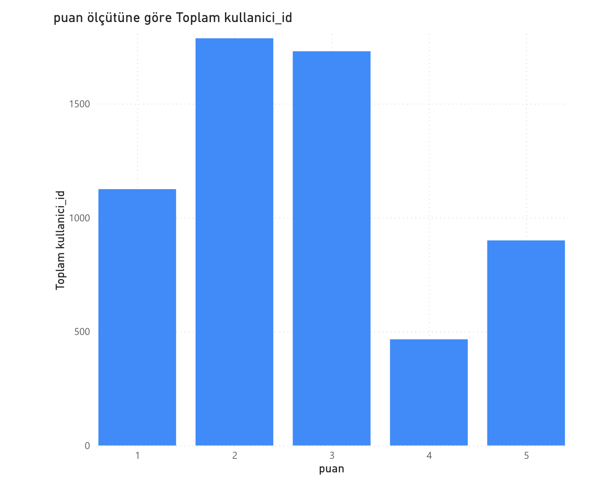

# Product Analyst Dashboard Projesi

## Proje Özeti
Bu proje, e-ticaret platformu kullanıcılarının işlem ve satın alma davranışlarını analiz etmek amacıyla hazırlanmıştır.  
Python kullanılarak farklı kaynaklardan CSV verileri işlenmiş, ardından Power BI ile görselleştirilip kullanıcı segmentasyonu ve geri bildirim analizleri gerçekleştirilmiştir.

## Ekran Resmi

## Kullanılan Veriler
- `kullanicilar.csv` — Kullanıcı bilgileri (ID, ad-soyad, cinsiyet, yaş vb.)  
- `islemler.csv` — Kullanıcı işlemleri (işlem türü, tarih, sayfa vb.)  
- `satin_alimlar.csv` — Satın alma kayıtları  
- `geri_bildirim.csv` — Kullanıcı geri bildirimleri ve puanları

## Projede Yapılanlar
- CSV dosyaları Python ile yüklendi ve temizlendi  
- Kullanıcı bazında toplam işlem sayısı, satın alma sayısı ve ortalama puan hesaplandı  
- Kullanıcı segmentasyonu yapıldı (`sadik_musteri`, `gezen_ama_almayan`, `olumsuz_geribildirim`, `diger`)  
- Power BI’da yaş dağılımı, cinsiyet dağılımı, işlem türleri ve puan dağılımı görselleri oluşturuldu  
- Zaman serisi analizleri ile kullanıcı davranışları incelendi  
- Akıllı anlatım (Smart Narrative) kullanılarak görsellerin yorumları otomatik olarak eklendi  
- Sonuçlar interaktif dashboard ve PDF rapor olarak sunuldu

## Kullanılan Teknolojiler
- Python (pandas, matplotlib, seaborn)  
-  Power BI Service  
- Jupyter Notebook

